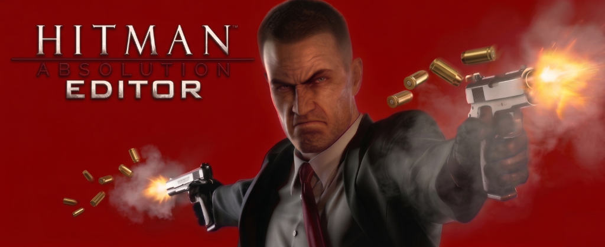
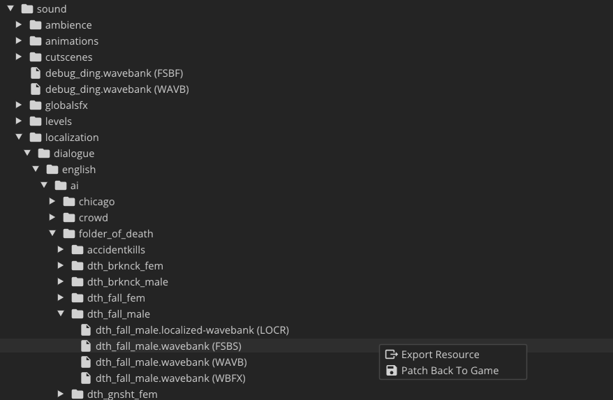
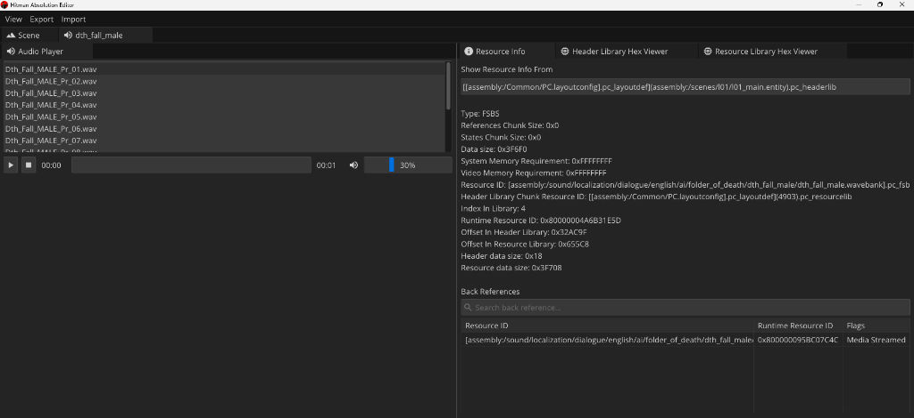
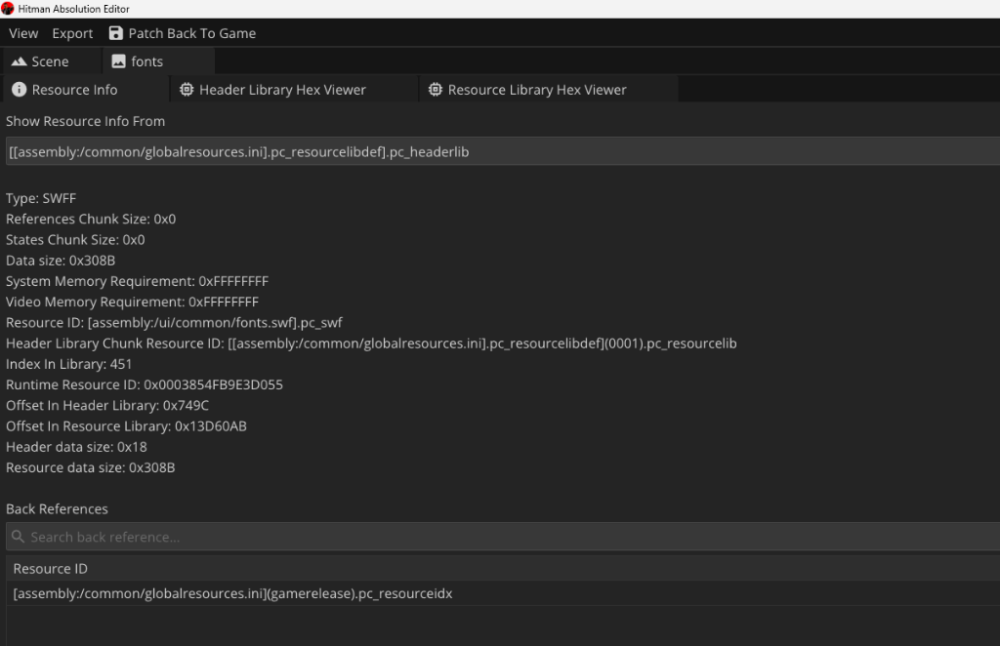
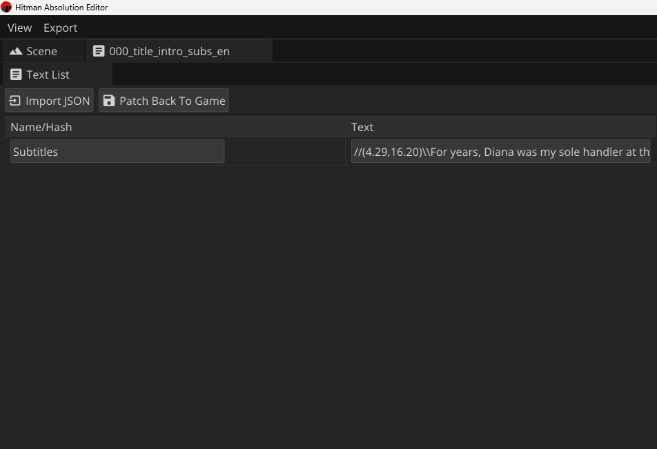
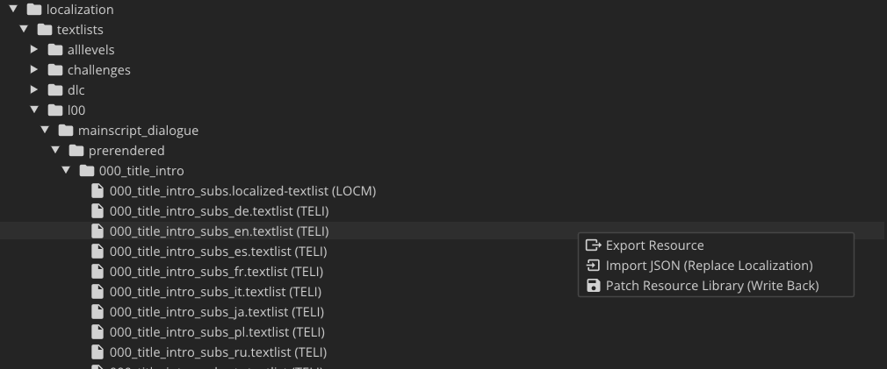

Потужний десктопний редактор (написаний на C++23) для модифікації ігрових ресурсів **Hitman: Absolution**. Цей інструмент надає зручний інтерфейс для перегляду, експорту та модифікації ассетів гри безпосередньо з файлів рушія `.pc_resourcelib` та `.pc_headerlib`.

*Мова:* [English](README.md) | [Українська](README_ua.md)

## Особливості та покращення

Цей форк має значні покращення порівняно з оригінальною версією, виправляє багато критичних помилок та має краще оптимізовану архітектуру коду.

**Основні нововведення та фікси:**
* **Виправлено краші**: Виправлено критичні помилки, через які редактор вилітав під час спроби відтворити аудіофайли. Тепер можна без проблем прослуховувати звуки прямо в редакторі.
* **Переглядач текстур**: Відновлено та полагоджено можливість переглядати зображення `.dds` прямо в програмі.
* **Іконка програми**: Додано нормальну іконку для застосунку.
* **Оптимізоване перезбирання**: Тепер програма безпечно патчить бібліотеки ресурсів, повністю їх перезбираючи (full rebuild approach), що запобігає пошкодженню ігрових файлів.
* **Автоматичні UI/UX виправлення**: Оптимізовано вивід консолі та виправлено баги з копіюванням/вставкою.

## Примітки щодо патчингу (УВАГА!)

Під час патчингу нових ресурсів назад у гру, будь ласка, суворо дотримуйтесь наступних правил, щоб гра не крашилась:

### 🔊 Звукові файли (`.wavb` / `.fsbs`)

* Для патчингу звуків файл має бути у форматі **`.ogg`**.
* Файл **обов'язково** повинен мати наступні параметри: частота дискретизації **48000 Hz**, канали: **Моно** (Mono).

### 🔤 Шрифти (`.swf`)

* Шрифти у грі зберігаються у вигляді файлів Flash Movie (`.swf`).
* **Рекомендація:** Експортуйте оригінальний ресурс на диск, відкрийте його за допомогою [JPEXS Free Flash Decompiler](https://github.com/jindrapetrik/jpexs-decompiler), внесіть необхідні зміни, збережіть новий `.swf` файл, а вже потім імпортуйте та патчіть його назад у гру.

### 🌐 Локалізація та Тексти (`.locm` / `.locr` / `.teli`)

* Субтитри, текст інтерфейсу та іншу локалізацію можна змінювати двома способами:
  1. **Прямо в редакторі:** Просто натисніть двічі на текст у вікні редактора, змініть його і натисніть "Patch Back To Game".
  2. **Експорт/Імпорт JSON:** Натисніть правою кнопкою миші на файл `.textlist`, оберіть "Export Resource", щоб зберегти його як `.json`. Потім відредагуйте текст у будь-якому текстовому редакторі та імпортуйте назад за допомогою "Import JSON (Replace Localization)".

### 🛡️ Автоматичні бекапи та відновлення

Аби захистити оригінальні ігрові файли, редактор автоматично створює бекапи (файли з розширенням `.bak`) перед першим застосуванням будь-якого патчу до файлів `.pc_resourcelib` чи `.pc_headerlib`.
* Якщо щось пішло не так або гра крашиться після патчу, ви можете легко повернути все назад.
* Для цього у вікні інспектора сцени натисніть кнопку **Tools** у верхньому меню та оберіть **Restore Backups**, щоб миттєво відновити оригінальні незмінені файли гри.

## Права та Форк

**Примітка**: Цей проєкт є модифікованим форком оригінального "Hitman Absolution Editor". В оригінальному репозиторії автор не надав жодної відкритої ліцензії (наприклад, GPL або MIT). Усі оригінальні права належать початковому автору. Зміни, внесені у цей форк, надаються "як є", з метою підтримання працездатності інструменту та допомоги спільноті моддерів гри.
